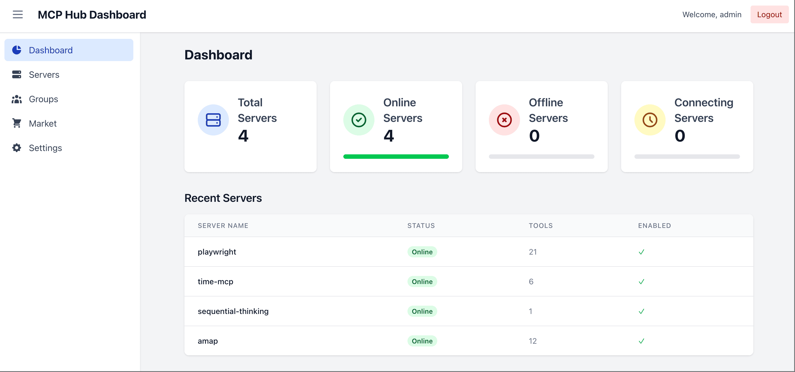

# MCPHub: Deploy Your Own MCP Servers in Minutes

English | [中文版](README.zh.md)

MCPHub is a unified hub server that consolidates multiple MCP (Model Context Protocol) servers into a single SSE endpoint. It streamlines service management by offering a centralized interface for all your MCP server needs.



## Features

- **Built-in MCP Servers**: Comes with featured MCP servers like `amap-maps`, `github`, `slack`, and more.
- **Centralized Management**: Oversee multiple MCP servers from one convenient hub.
- **Broad Protocol Support**: Works seamlessly with both stdio and SSE MCP protocols.
- **Intuitive Dashboard UI**: Monitor server status and manage servers dynamically via a web interface.
- **Flexible Server Management**: Add, remove, or reconfigure MCP servers without restarting the hub.

## Quick Start

### Using Docker

Run the following command to quickly launch MCPHub:

```bash
docker run -p 3000:3000 samanhappy/mcphub
```

### Dashboard Access

Open your web browser and navigate to:  
`http://localhost:3000`

The dashboard provides:
- **Real-Time Monitoring**: Keep an eye on the status of all MCP servers.
- **Service Status Indicators**: Quickly see which services are online.
- **Dynamic Server Management**: Add or remove MCP servers on the fly without needing to restart.

### SSE Endpoint

Seamlessly connect your host applications (e.g., Claude Desktop, Cursor, Cherry Studio, etc.) to the MCPHub SSE endpoint at:  
`http://localhost:3000/sse`

## Local Development

### Clone the Repository

Clone MCPHub from GitHub:

```bash
git clone https://github.com/samanhappy/mcphub.git
```

### Optional Configuration

Customize your MCP server settings by editing the `mcp_settings.json` file. For example:

```json
{
  "mcpServers": {
    "time-mcp": {
      "command": "npx",
      "args": ["-y", "time-mcp"]
    },
    "sequential-thinking": {
      "command": "npx",
      "args": ["-y", "@modelcontextprotocol/server-sequential-thinking"]
    }
  }
}
```

### Start the Development Server

Install dependencies and launch MCPHub:

```bash
cd mcphub && pnpm install && pnpm dev
```

## License

This project is licensed under the [MIT License](LICENSE).
